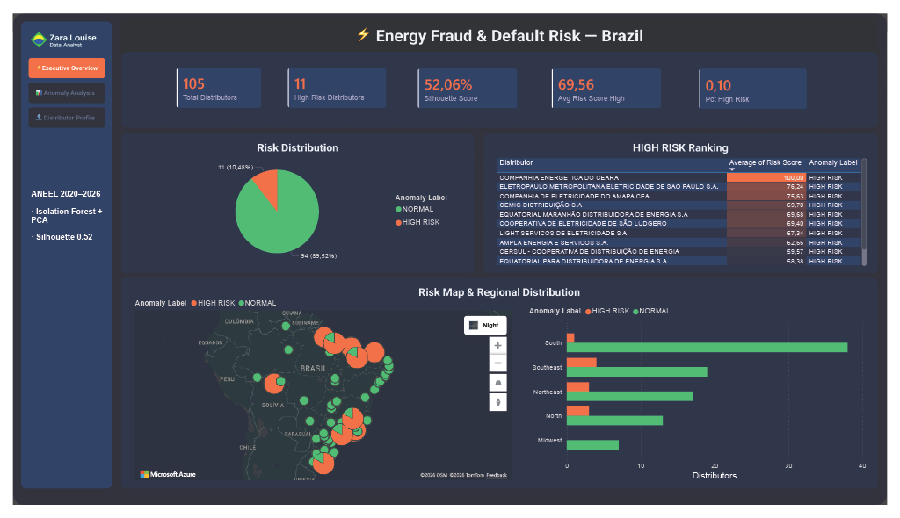
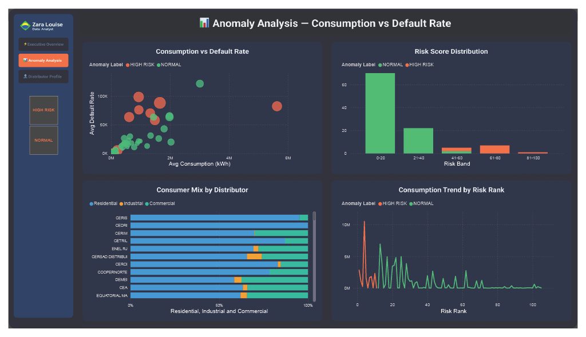
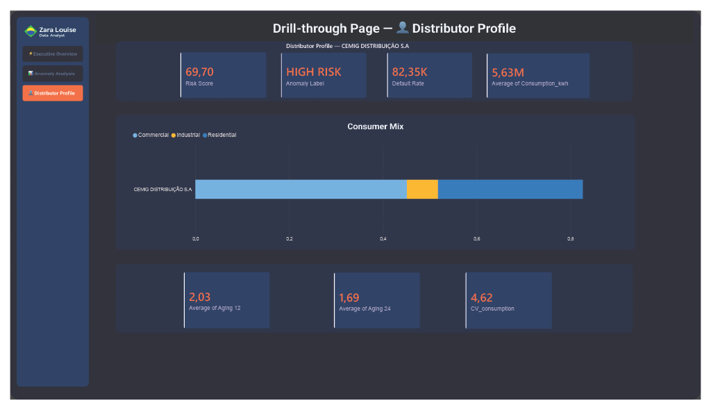

# 📈 Power BI Dashboard — Energy Fraud & Default Risk

> Interactive 3-page Power BI report delivering insights from the anomaly detection pipeline. Built on Gold layer tables (`features_distributor` and `risk_scores`) connected via Databricks DirectQuery.

---

## 📋 Table of Contents

- [Overview](#overview)
- [Preview](#preview)
- [Design & Layout](#design--layout)
- [Pages](#pages)
- [Data Model](#data-model)
- [DAX Measures](#dax-measures)
- [Calculated Columns](#calculated-columns)
- [Calculated Tables](#calculated-tables)
- [Custom Tables](#custom-tables)
- [Visuals & Configuration](#visuals--configuration)
- [Theme](#theme)
- [Setup](#setup)

---

## Overview

| Property | Value |
|---|---|
| **File** | `energy-fraud.pbix` |
| **Canvas size** | 1600 × 900 px |
| **Connection** | Databricks DirectQuery |
| **Gold tables** | `features_distributor`, `risk_scores` |
| **Calculated tables** | `risk_scores_region` (Power BI — joins region to risk scores) |
| **Custom tables** | `dim_uf` (state mapping with coordinates and region) |
| **Pages** | 3 (Executive Overview · Anomaly Analysis · Distributor Profile) |
| **Theme** | Custom dark — `energy-fraud-theme.json` |
| **Layout design** | Figma (DashStack template — adapted) |

---

## Preview

### Page 1 — Executive Overview


### Page 2 — Anomaly Analysis


### Page 3 — Distributor Profile (drill-through)


---

## Design & Layout

The dashboard layout was designed in **Figma** before implementation in Power BI. The base template used was [DashStack - Free Admin Dashboard UI Kit](https://www.figma.com/community/file/1357097430680045574) by Seju, adapted to the project's visual identity.

### Layout structure

```
┌─────────────┬──────────────────────────────────────────────┐
│   SIDEBAR   │              CONTENT AREA                    │
│   180px     │              1420px                          │
│             │                                              │
│  [Logo]     │  Page title                                  │
│  Zara Louise│  ─────────────────────────────────────────── │
│  Data       │                                              │
│  Analyst    │  [Visuals specific to each page]             │
│             │                                              │
│  ─────────  │                                              │
│  ⚡ Exec.   │                                              │
│  📊 Anal.   │                                              │
│  👤 Prof.   │                                              │
│             │                                              │
│  ─────────  │                                              │
│  ANEEL      │                                              │
│  2020–2026  │                                              │
│  Isolation  │                                              │
│  Forest+PCA │                                              │
│  Sil: 0.52  │                                              │
└─────────────┴──────────────────────────────────────────────┘
```

### Page 1 — Executive Overview layout

```
┌────────────────────────────────────────────────────┐
│  [KPI] [KPI] [KPI] [KPI] [KPI]                    │
├──────────────────────┬─────────────────────────────┤
│   Risk Distribution  │   HIGH RISK Ranking Table   │
│   (Donut)            │                             │
├──────────────────────┴─────────────────────────────┤
│   Risk Map — Brazil  │   Risk by Region            │
│   (Azure Maps)       │   (Clustered bar)           │
└──────────────────────┴─────────────────────────────┘
```

### Figma → Power BI workflow

1. Layout wireframed in Figma using DashStack as base
2. Colors adapted to project palette (`#1A1A2E`, `#0F3460`, `#FF6B35`, `#2ECC71`)
3. Figma frame exported as PNG (1600×900)
4. PNG imported as **page background image** in Power BI
5. Visuals positioned over the background slots
6. Navigation buttons configured with **Page Navigation** action

### Sidebar implementation in Power BI

The sidebar is built with:
- **Rectangle** shape: X=0, Y=0, W=180, H=900, fill `#0F3460`
- **Logo image**: positioned inside the rectangle
- **3 blank buttons** with Page Navigation action (one per page); active page button = `#FF6B35`
- **Text box** with project metadata (`#A0A0C0`, 9pt)
- On the Distributor Profile page, the sidebar also shows a **dynamic title card** with the selected distributor name (see DAX Measures → `Title Distributor Profile`)

---

## Pages

### Page 1 — Executive Overview

High-level summary of the risk landscape across all 105 Brazilian electricity distributors.

| Visual | Type | Fields | Notes |
|---|---|---|---|
| Header | Text box | — | Title + subtitle with project metadata |
| Total Distributors | Card | `[Total Distributors]` | Count of all distributors |
| High Risk Distributors | Card | `[High Risk Distributors]` | Count of anomaly-labeled distributors |
| Silhouette Score | Card | `[Silhouette Score]` | Fixed value — model quality metric |
| Avg Risk Score High | Card | `[Avg Risk Score High]` | Average risk score among HIGH RISK group |
| Pct High Risk | Card | `[Pct High Risk]` | Share of HIGH RISK distributors |
| Risk Distribution | Donut | Legend = `anomaly_label`, Values = `[Total Distributors]` | HIGH RISK = `#FF6B35`, NORMAL = `#2ECC71` |
| HIGH RISK Ranking | Table | `distributor_name`, `risk_score` (Average), `anomaly_label` | Filtered to HIGH RISK; sorted DESC; conditional gradient on risk_score; dark theme applied |
| Risk Map | Azure Maps | Lat/Lng from `dim_uf`, Size = `avg_default_rate` (Average), Legend = `anomaly_label` | Bubble size proportional to risk score; Night map style |
| Risk by Region | Clustered bar | Y = `risk_scores_region[region]`, X = Count of `risk_scores_region[distributor_code]`, Legend = `risk_scores_region[anomaly_label]` | HIGH RISK = `#FF6B35`, NORMAL = `#2ECC71`; Y axis title off; X axis title = "Distributors" |

---

### Page 2 — Anomaly Analysis

Deep-dive into consumption patterns and model outputs across all 105 distributors.

| Visual | Type | Fields | Notes |
|---|---|---|---|
| Header | Text box | — | Page title |
| Slicer | Tile slicer | `anomaly_label` | Filters all visuals on page; HIGH RISK = `#FF6B35` |
| Consumption vs Default Rate | Bubble chart | X = `avg_consumption_kwh`, Y = `avg_default_rate`, Size = `risk_score`, Legend = `anomaly_label` | HIGH RISK = `#FF6B35`, NORMAL = `#2ECC71` |
| Risk Score Distribution | Clustered column chart | X = `Risk Band`, Y = Count of `distributor_code`, Legend = `anomaly_label` | Ordered via `Risk Band Order` column |
| Consumer Mix by Distributor | Stacked bar chart | Y = `distributor_name`, X = Avg of `Residential`, `Industrial`, `Commercial` | Residential = `#3498DB`, Industrial = `#F39C12`, Commercial = `#1ABC9C` |
| Consumption Trend by Risk Rank | Line chart | X = `risk_rank`, Y = Avg of `consumption_trend`, Legend = `anomaly_label` | HIGH RISK = `#FF6B35`, NORMAL = `#2ECC71`; X axis title = "Risk Rank" |

---

### Page 3 — Distributor Profile

Drill-through page. Access: right-click any distributor → Drill through → Distributor Profile. The page header reads **"⬅ Drill-through Page — 👤 Distributor Profile"**, and the sidebar shows the selected distributor name dynamically.

**Drill-through field:** `Risk Scores[distributor_name]`

> Card labels below reflect the exact field names as they appear in the report.

| Visual | Type | Field | Notes |
|---|---|---|---|
| Risk Score | Card | `risk_score` (Average) | Individual distributor risk score |
| Anomaly Label | Card | `anomaly_label` (First) | HIGH RISK or NORMAL |
| Default Rate | Card | `avg_default_rate` (Average) | Distributor's average default rate |
| Average of Consumption_kwh | Card | `avg_consumption_kwh` (Average) | Distributor's average monthly consumption |
| Consumer Mix | Stacked bar chart | Y = `distributor_name`, X = Avg of `pct_residential`, `pct_industrial`, `pct_commercial` | Single bar per distributor |
| Average of Aging 12 | Card | `avg_aging_12` (Average) | Average debt aging at 12 months |
| Average of Aging 24 | Card | `avg_aging_24` (Average) | Average debt aging at 24 months |
| CV_consumption | Card | `cv_consumption` (Average) | Coefficient of variation — ML instability signal |

---

## Data Model

```
features_distributor ──── Risk Scores
  distributor_code    1:1   distributor_code

dim_uf ──────────────────── Features
  distributor_code    *:1   distributor_code
  (relationship toward Risk Scores kept INACTIVE — see note below)

risk_scores_region ── calculated table
  Joins Risk Scores + dim_uf[region] via LOOKUPVALUE
  Used exclusively for the Risk by Region chart
```

> **Why a calculated table instead of an active relationship?**
> Activating `dim_uf` → `Risk Scores` while `dim_uf` → `Features` is also active produces an *ambiguous path* error in Power BI. Rather than juggle USERELATIONSHIP across every measure, the region attribute is materialized once into `risk_scores_region` via `LOOKUPVALUE`, keeping the region chart simple and conflict-free.

All measures are stored in a dedicated `measures_` table.

---

## DAX Measures

```dax
Total Distributors =
DISTINCTCOUNT('Risk Scores'[distributor_code])
```

```dax
High Risk Distributors =
CALCULATE(
    DISTINCTCOUNT('Risk Scores'[distributor_code]),
    'Risk Scores'[anomaly_label] = "HIGH RISK"
)
```

```dax
Silhouette Score = 0.5206
-- Fixed value from MLflow model run
```

```dax
Avg Risk Score High =
CALCULATE(
    AVERAGE('Risk Scores'[risk_score]),
    'Risk Scores'[anomaly_label] = "HIGH RISK"
)
```

```dax
Pct High Risk =
DIVIDE([High Risk Distributors], [Total Distributors], 0)
-- Format as percentage
```

```dax
Title Distributor Profile =
"Distributor Profile — " &
SELECTEDVALUE('Risk Scores'[distributor_name], "Select a distributor")
-- Dynamic title shown in the sidebar of the drill-through page
```

---

## Calculated Columns

### Risk Band

Groups distributors into risk score buckets. Zero-padded prefix enforces sort order.

```dax
Risk Band =
SWITCH(
    TRUE(),
    'Risk Scores'[risk_score] <= 20, "01 | 0-20",
    'Risk Scores'[risk_score] <= 40, "02 | 21-40",
    'Risk Scores'[risk_score] <= 60, "03 | 41-60",
    'Risk Scores'[risk_score] <= 80, "04 | 61-80",
    "05 | 81-100"
)
```

### Risk Band Order

Numeric sort key. Set as **Sort by Column** for `Risk Band` via Column Tools.

```dax
Risk Band Order =
SWITCH(
    TRUE(),
    'Risk Scores'[risk_score] <= 20, 1,
    'Risk Scores'[risk_score] <= 40, 2,
    'Risk Scores'[risk_score] <= 60, 3,
    'Risk Scores'[risk_score] <= 80, 4,
    5
)
```

---

## Calculated Tables

### risk_scores_region

Created via **Modeling → New Table**. Joins `Risk Scores` with `dim_uf[region]` using `LOOKUPVALUE` — see the Data Model note for the rationale.

```dax
risk_scores_region =
ADDCOLUMNS(
    'Risk Scores',
    "region",
    LOOKUPVALUE(
        'dim_uf'[region],
        'dim_uf'[distributor_code],
        'Risk Scores'[distributor_code]
    )
)
```

**Used in:** Risk by Region chart (Page 1)
**Columns:** all `Risk Scores` columns + `region` (text)

---

## Custom Tables

### dim_uf

Created in Power Query (blank query → Advanced Editor). Maps every distributor code to its Brazilian state (UF), geographic coordinates, and region. Regions are in English.

**Columns:** `distributor_code` (text), `state` (text), `latitude` (decimal), `longitude` (decimal), `region` (text)

**Regions:** North · Northeast · Midwest · Southeast · South

**Sample rows:**

| distributor_code | state | latitude | longitude | region |
|---|---|---|---|---|
| ENEL CE | CE | -3.73 | -38.52 | Northeast |
| ELETROPAULO | SP | -23.55 | -46.63 | Southeast |
| CEMIG-D | MG | -19.92 | -43.94 | Southeast |
| CEGERO | RO | -11.50 | -63.58 | North |
| COPEL-DIS | PR | -25.43 | -49.27 | South |

> The table covers all 105 distributors. Cooperatives and smaller distributors were added manually so every `distributor_code` in `Risk Scores` resolves to a region — eliminating blank values in the Risk by Region chart.

---

## Visuals & Configuration

### Azure Maps
- **Tenant requirement:** Enable all three Azure Maps switches in Power BI Admin Portal → Tenant Settings → Integration Settings
- **Map style:** Night
- **Bubble size:** HIGH RISK max = 20px, NORMAL max = 20px
- **Color:** HIGH RISK = `#FF6B35`, NORMAL = `#2ECC71`

### Risk by Region — Clustered Bar Chart
- **Data source:** `risk_scores_region` calculated table (not `Risk Scores` directly)
- **Y axis title:** off
- **X axis title:** Distributors
- **Legend:** Anomaly Label — HIGH RISK = `#FF6B35`, NORMAL = `#2ECC71`

### HIGH RISK Ranking Table — Dark Theme
Apply via **Format visual → Values** and **Column headers**:

| Setting | Value |
|---|---|
| Values → Background color | `#16213E` |
| Values → Text color | `#E8E8F0` |
| Values → Alternate background | `#0F3460` |
| Column headers → Background | `#0F3460` |
| Column headers → Text color | `#E8E8F0` |

### Conditional Formatting — Risk Score column (Page 1 table)
- **Format style:** Gradient
- **Minimum color:** `#16213E`
- **Maximum color:** `#FF6B35`
- **Apply to:** Values only

---

## Theme

Custom JSON theme file: `energy-fraud-theme.json`

| Role | Hex |
|---|---|
| Primary accent (HIGH RISK) | `#FF6B35` |
| Secondary accent (NORMAL) | `#2ECC71` |
| Warning | `#F39C12` |
| Background (page) | `#1A1A2E` |
| Background (visuals) | `#16213E` |
| Background (sidebar / cards) | `#0F3460` |
| Text primary | `#E8E8F0` |
| Text secondary | `#A0A0C0` |

To apply: **View → Themes → Browse for themes** → select `energy-fraud-theme.json`

---

## Setup

### Prerequisites
- Power BI Desktop (Windows)
- Databricks workspace with Gold layer tables available
- Azure Maps enabled in your Power BI tenant

### Steps

1. **Clone the repository**
   ```bash
   git clone https://github.com/zaraluz/energy-fraud-detection.git
   ```

2. **Open the report**
   ```
   Open dashboard/energy-fraud.pbix in Power BI Desktop
   ```

3. **Update the Databricks connection**
   - Home → Transform Data → Data Source Settings
   - Update the Databricks server hostname and HTTP path to your workspace
   - Authenticate with your Databricks personal access token

4. **Apply the theme**
   - View → Themes → Browse for themes → select `energy-fraud-theme.json`

5. **Refresh data**
   - Home → Refresh

### Troubleshooting

| Issue | Solution |
|---|---|
| Azure Maps shows "not enabled for your organization" | Enable all three Azure Maps switches in Power BI Admin Portal → Tenant Settings → Integration Settings |
| Native map visual blocked | Same admin portal fix — enable "Map and filled map visuals" |
| `dim_uf` relationship broken | Verify distributor codes match exactly between `dim_uf` and `Risk Scores[distributor_code]` |
| DAX errors referencing `risk_scores` | Table name in Power BI is `Risk Scores` (with space) — wrap in single quotes: `'Risk Scores'[column]` |
| Risk by Region shows blank values | A `distributor_code` in `Risk Scores` is missing from `dim_uf` — add the missing row(s) to the Power Query source |
| Ambiguous path error when activating dim_uf → Risk Scores | Expected — keep that relationship inactive and use the `risk_scores_region` calculated table instead |

---

*Built as part of the [energy-fraud-detection](https://github.com/zaraluz/energy-fraud-detection) portfolio project.*
